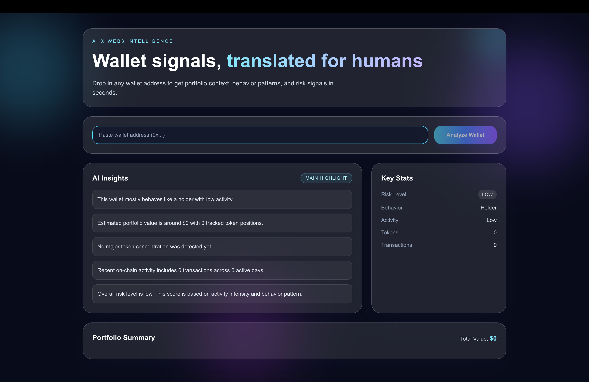

# 🤖 AI Web3 Wallet Assistant

⭐ If you find this useful, please star the repo — it helps a lot!

An AI-powered assistant that analyzes any crypto wallet and explains **what it actually does**.

Ask a question like:

> “What does this wallet do?”

Get insights like:
- 📊 Portfolio breakdown
- 📈 Trading behavior
- ⚠️ Risk level
- 🧠 Smart insights powered by AI

Built with **Next.js, TypeScript, OpenAI, and Web3 APIs**.

---

## 🚀 Live Demo

https://ai-web3-wallet-assistant.vercel.app/

---

## 📸 Preview



---

## ✨ Features

- 🤖 AI-powered wallet analysis
- 💬 Natural language interface (chat-style)
- 📊 Portfolio insights
- 📈 Trading behavior detection
- ⚠️ Risk analysis (basic heuristics)
- 🌐 Multi-chain support (Ethereum, Polygon, Base, Arbitrum)
- ⚡ Fast and responsive UI

---

## 💡 Why This Project

Most Web3 tools show raw data.

But users don’t want raw data — they want **understanding**.

This project bridges the gap between:
- complex blockchain data
- and human-readable insights

👉 Turning wallets into **stories, not spreadsheets**

---

## 🧠 How It Works

1. User inputs wallet address
2. Fetch:
   - token balances
   - transaction history
3. Process data into structured format
4. Send to AI model (OpenAI)
5. Generate:
   - summary
   - behavior insights
   - risk evaluation
6. Display response in chat UI

---

## 🧪 Example Prompts

- “What does this wallet do?”
- “Is this wallet risky?”
- “Is this wallet accumulating or selling?”
- “What are the main assets in this wallet?”

---

## 🧰 Tech Stack

- **Next.js (App Router)**
- **TypeScript**
- **Tailwind CSS**
- **OpenAI API**
- **Viem** (on-chain data)
- **Moralis / Alchemy** (wallet data)

---

## ⚙️ Setup

### 1. Clone the repo

```bash
git clone https://github.com/khalilahmed63/ai-web3-wallet-assistant.git
cd ai-web3-assistant
```

### 2. Install dependencies

```bash
npm install
```

### 3. Add environment variables

Create a `.env.local` file:

```bash
HUGGINGFACE_API_KEY=your_openai_api_key
MORALIS_API_KEY=your_moralis_api_key
```

### 🔑 How to get API keys

**Hugging Face**
- Go to https://huggingface.co/settings/tokens
- Create an account
- Generate a token with Read permission

**Moralis**
- Go to https://moralis.io/
- Create a project
- Copy your API key

### 4. Run the app

```bash
npm run dev
```

Open:

http://localhost:3000

---

## 🌍 Supported Chains

- Ethereum
- Polygon
- Base
- Arbitrum

---

## 📈 Roadmap

- [ ] Advanced risk scoring
- [ ] Wallet classification (Trader / Holder / Whale)
- [ ] Historical behavior analysis
- [ ] Multi-wallet comparison
- [ ] RAG-based insights (vector DB)
- [ ] AI memory for conversations

---

## 🧠 Future Vision

This project can evolve into:

- AI-powered trading assistant
- Smart wallet scoring system
- Web3 research tool
- Portfolio advisor

---

## 🤝 Contributing

Contributions are welcome!

- Open issues
- Submit PRs
- Suggest improvements

---

## 👨‍💻 Author

Khalil Ahmed

Frontend Engineer building Web3 analytics platforms.

Portfolio: https://www.khalilahmed.dev
LinkedIn: https://www.linkedin.com/in/khalil-ahmed-308a061a6
GitHub: https://github.com/khalilahmed63

---

## ⭐ Support

If you find this project useful, please ⭐ the repo!

# ai-web3-wallet-assistant
